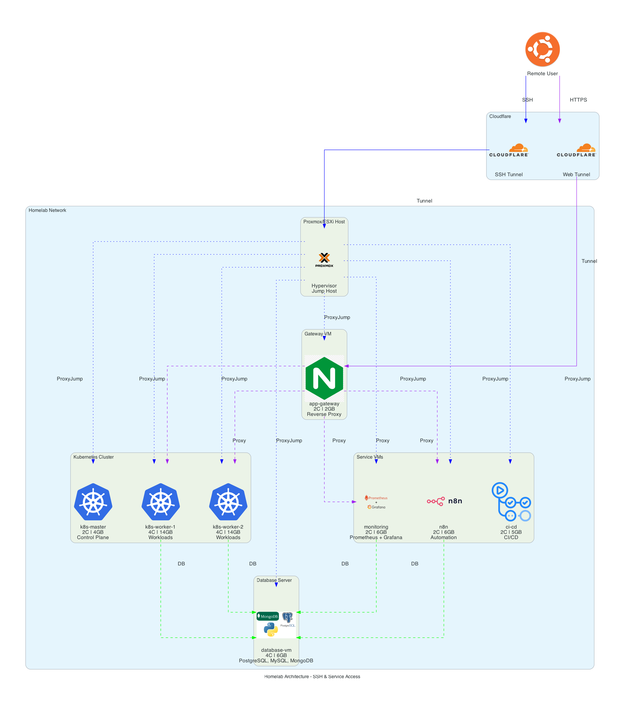

# Homelab Journey

Welcome to my homelab infrastructure repository! This is the central hub for documenting my homelab setup, configurations, and learnings.

Note that this project is not intended for heavy production workloads. In Cambodia, stable electricity and high-speed internet are not guaranteed, so this homelab is designed for learning, experimentation, and personal projects rather than critical applications. So, if you plan to use this as a reference for your own homelab, please consider the limitations of your environment and adjust accordingly.

## YouTube Video
I intended to release YouTube videos docummenting this journey. 
- [1st Video: ខ្ញុំលែងប្រើ Cloud ហើយធ្វើ HomeLab Server មួយខ្លួនឯង | Moving from Cloud to Home Lab](https://youtu.be/VtUXaHL9B6Q?si=FgUlQjMOOWyEZPOM)

## Architecture Overview


## 💻 Hardware Specifications

### Physical Server

**Model:** [GMKTec NucBox M5 Ultra](https://www.gmktec.com/products/gmktec-nucbox-m5-ultra-amd-ryzen-7-7730u-mini-pc?srsltid=AfmBOoorhiy8lA8zcl84Y1xBUw8JpoQ3IK0ZZHDvCHwWh_4E6TqWQABL) 

**CPU:** AMD Ryzen 7 7730U
- 8 Cores / 16 Threads
- Base Clock: 2.0 GHz
- Boost Clock: up to 4.5 GHz
- L1 Cache: 512 KB (64KB × 8)
- L2 Cache: 4 MB (512KB × 8)
- L3 Cache: 16 MB (shared)
- TDP: 15-35W
- Architecture: Zen 3+ (6nm)

**Memory:** 64 GB DDR4 RAM
- Type: DDR4 SO-DIMM
- Speed: 3200 MHz
- Configuration: Dual Channel
- Maximum Capacity: 64 GB

**Storage:** 1 TB NVMe SSD
- Type: M.2 2280 NVMe PCIe Gen 3.0
- Read Speed: ~3500 MB/s
- Write Speed: ~3000 MB/s
- TBW: High endurance model

**Graphics:** AMD Radeon Graphics
- Integrated GPU (Ryzen 7730U)
- Cores: 8 CUs (Compute Units)
- Architecture: RDNA 2
- Max Frequency: 2.0 GHz
- Display Support: Dual 4K@60Hz or Single 8K@30Hz

**Operating System:**
- **Proxmox VE 9.1.1** (Debian-based hypervisor)
- Linux Kernel 6.8+
- ZFS or ext4 filesystem options
- Web UI: https://192.168.100.50:8006

### Why This Hardware?

✅ **Power Efficiency** - 15-35W TDP, ideal for 24/7 operation  
✅ **Performance** - 8c/16t handles multiple VMs simultaneously  
✅ **Memory** - 64GB sufficient for 8+ VMs with headroom  
✅ **Storage** - Fast NVMe for quick VM boot and low latency  
✅ **Dual NIC** - Network segregation and redundancy  
✅ **Compact** - Minimal footprint, quiet operation  
✅ **Cost Effective** - Fraction of enterprise server costs  

## 🏗️ Infrastructure Overview

This homelab runs on Proxmox VE and uses Infrastructure as Code (Terraform + Ansible) for reproducible deployments.

### Virtual Machines

| VM | IP | CPU | RAM | Disk | Purpose |
|---|---|---|---|---|---|
| k8s-master | 192.168.100.201 | 2 | 4 GB | 50 GB | Kubernetes control plane (K3s) | 
| k8s-worker-1 | 192.168.100.202 | 4 | 14 GB | 150 GB | Kubernetes worker node |
| k8s-worker-2 | 192.168.100.203 | 4 | 14 GB | 150 GB | Kubernetes worker node | 
| database-vm | 192.168.100.205 | 4 | 6 GB | 200 GB | Centralized database server |
| app-gateway | 192.168.100.210 | 2 | 2 GB | 20 GB | Nginx reverse proxy |
| monitoring | 192.168.100.220 | 2 | 6 GB | 80 GB | Prometheus, Grafana, Loki | 
| n8n | 192.168.100.230 | 2 | 6 GB | 50 GB | n8n workflow automation | ✅ Adequate |
| ci-cd | 192.168.100.240 | 2 | 5 GB | 100 GB | GitHub Actions + Docker registry |

**Total Resources:** 21 CPU cores, 57 GB RAM, 820 GB storage  
**Available for Host:** 3 cores (37.5%), 7 GB RAM (10.9%), ~180 GB storage

**Resource Allocation Notes:**
- All VMs have adequate resources for their intended workloads
- CI/CD VM may require additional RAM (8GB+) for heavy Docker builds
- 7GB RAM reserved for Proxmox host ensures system stability
- Storage allocation allows for data growth and logs
- Balanced allocation prevents resource contention

## 📂 Repository Structure

```
homelab-journey/
├── terraform/           # Infrastructure provisioning
│   ├── vms.tf          # VM definitions
│   ├── variables.tf    # Configurable variables
│   └── terraform.tfvars # Your configuration
├── ansible/            # Configuration management (organized)
│   ├── inventory.ini   # VM inventory
│   ├── ansible.cfg     # Ansible configuration
│   ├── README.md       # Ansible documentation
│   └── playbooks/      # 🆕 Organized playbooks by category
│       ├── infrastructure/    # Core infrastructure setup
│       │   ├── proxmox-setup.yml
│       │   ├── qemu-agent-setup.yml
│       │   ├── docker-setup.yml
│       │   └── nginx-gateway-setup.yml
│       ├── kubernetes/        # K8s cluster deployment
│       │   └── k3s-cluster-setup.yml
│       ├── services/          # Application services
│       │   ├── database-setup.yml
│       │   ├── monitoring-setup.yml
│       │   ├── monitoring-dashboards-setup.yml
│       │   ├── n8n-setup.yml
│       │   └── cicd-setup.yml
│       └── networking/        # Network & remote access
│           ├── cloudflare-tunnel-setup.yml
│           └── github-runner-setup.yml
├── script/             # Helper scripts
│   ├── setup-k8s-complete.sh
│   ├── setup-cloudflare-tunnel.sh
│   ├── run-monitoring-setup.sh
│   ├── run-monitoring-dashboards-setup.sh
│   ├── run-n8n-setup.sh
│   ├── run-database-setup.sh
│   ├── generate-ssh-keys.sh
│   └── cleanup-known-hosts.sh
├── diagram/            # Infrastructure diagrams
```

## Bootstrapping The Infrastructure

### Prerequisites

Before starting, ensure you have:
- ✅ [Proxmox VE](https://www.proxmox.com/en/downloads/proxmox-virtual-environment/iso/proxmox-ve-9-1-iso-installer) installed and configured
- ✅ SSH keys generated (run `./generate-ssh-keys.sh` you'll find the keys in `ssh-keys/` directory after running the script. This will be used for Ansible access to VMs)
- ✅ Ansible installed on your control machine
- ✅ GitHub account (for CI/CD setup)
- ✅ Cloudflare account (for tunnel setup)
- ✅ Domain name configured in Cloudflare DNS
  
### 1. Configure Proxmox Host with Basic Packages with Ansible

Replace YOUR_SSH_PUBLIC_KEY_HERE in `proxmox-setup.yml` with your actual SSH public key to enable passwordless SSH access to the VMs.

```bash
cd ansible
ansible-playbook playbooks/infrastructure/proxmox-setup.yml
```
This playbook will setup basic packages such as `fastfetch`, `htop`, `lm-sensors`, `qemu-guest-agent`, create cloud-init configuration for terraform to use that add ssh user with your public key.


### 2. Provision VMs with Terraform

For now, CPU Type for `proxmox_virtual_environment_vm` is set to `host` because We experience MongoDB  v8.4 not working (AVX2 not detected) when using `X86-64-AES` CPU type. We will investigate this further and update the configuration if needed. This can be the issue if we migrate another host with different CPU architecture in the future.

Make sure to create `terraform.tfvars` with your specific configuration (IP addresses, credentials, etc.) before running Terraform. See [Terraform Configuration](terraform/README.md) for details.

```bash
cd terraform
terraform init
terraform plan
terraform apply -auto-approve
```

It might take awhile for `qemu-agent` to be installed and for the VMs to be fully provisioned and gives signal back to Terraform. You can check the Proxmox Web UI to monitor the VM creation process.

### 3. SSH Access to VMs
```bash
ssh -i path/to/ssh-keys ubuntu@192.168.100.201 # Master node
ssh -i path/to/ssh-keys ubuntu@192.168.100.202 # Worker 1
ssh -i path/to/ssh-keys ubuntu@192.168.100.203 # Worker 2
```


## Configuring Infrastructure Components with Ansible

This section provides detailed step-by-step instructions for manually setting up the entire infrastructure.

Before setting up each component, make sure you create an ansible `inventory.ini` from the provided `inventory.ini.example` and update the IP addresses and credentials as needed. There is `/path/to/your/key` which is the path to your private SSH key that matches the public key you added to `proxmox-setup.yml` for Ansible access.

### 1. Setup CI/CD VM
This will install GitHub Actions runner and Docker registry on the CI/CD VM.

```bash
cd ansible
ansible-playbook playbooks/services/cicd-setup.yml
```

Note that you will need to manually configure the GitHub runner token after installation. See the playbook documentation for instructions.

### 2. Setup Kubernetes Cluster

Run the K3s cluster setup playbook to configure the master and worker nodes:

```bash
cd ansible
ansible-playbook playbooks/kubernetes/k3s-cluster-setup.yml
```

This playbook will:
- Install K3s on the master node
- Configure worker nodes to join the cluster
- Setup kubectl configuration
- Verify cluster health

**Verify:**
```bash
ssh -i path/to/ssh-keys ubuntu@192.168.100.201 # SSH into master node
kubectl get nodes
# Should show: k8s-master, k8s-worker-1, k8s-worker-2 all Ready
```

Each k8s worker node will be configured to refer to the registry on the CI/CD VM for pulling images via `registry.homelab.local` hostname.

**Verify registry access:**
```bash
# From master node
curl -v http://registry.homelab.local/v2/_catalog
# Should return JSON with list of repositories (even if empty)
```

### 3. Setup Gateway VM

This will install Nginx Proxy Manager on the gateway VM and configure it as a reverse proxy for your Kubernetes services.

```bash
# Run interactive setup script
cd ansible
ansible-playbook playbooks/networking/nginx-gateway-setup.yml
```

The script will:
1. Install Nginx on the gateway VM
2. Setup health checks and monitoring

Access the admin UI at http://192.168.100.210:81. You will be asked to create an admin account on first login. Use this UI to configure reverse proxy rules for your Kubernetes services.

### 5. Setup Database Server VM
This will install PostgreSQL, MySQL, and MongoDB on the database server VM. Create `.env` from the provided `.env.example` in the `ansible` directory and set secure passwords for each database. Then run the prepared script to setup the databases.

```bash
chmod ./script/run-database-setup.sh
./script/run-database-setup.sh
```

Note that this will load passwords from the `.env` file. If you run ansible playbook directly, make sure to set the environment variables or edit the playbook to include the passwords.

### 6. Setup n8n Workflow Automation
This will install n8n on the n8n VM and configure it to use the PostgreSQL database on the database server VM.

```bash
cd ansible
ansible-playbook playbooks/services/n8n-setup.yml
```

This playbook will:
- Install GitHub Actions self-hosted runner
- Install Docker and setup local registry
- Install kubectl and helm for Kubernetes deployments

## 7. Setup Monitoring Stack
This will install Prometheus, Grafana, and Loki on the monitoring VM and configure them to monitor your Kubernetes cluster and other services.

```bash
cd ansible
ansible-playbook playbooks/services/monitoring-setup.yml
ansible-playbook playbooks/services/monitoring-dashboards-setup.yml
```

## Operations & Quick Reference

### Daily Operations

#### Cluster Status
```bash
# Check node health
kubectl get nodes
kubectl describe node k8s-worker-1

# View all resources
kubectl get all --all-namespaces

# Check cluster component status
kubectl get componentstatuses

# View cluster events
kubectl get events --all-namespaces --sort-by='.lastTimestamp'
```

#### Application Management
```bash
# List all pods
kubectl get pods -n your-namespace

# View deployment status
kubectl get deployments -n your-namespace

# Check services
kubectl get svc -n your-namespace

# View ingress routes
kubectl get ingress --all-namespaces

# Port forward for local access
kubectl port-forward svc/myapp 8080:80 -n your-namespace
```

#### Logs and Debugging
```bash
# View pod logs
kubectl logs pod-name -n namespace

# Follow logs in real-time
kubectl logs -f deployment/myapp -n namespace

# View logs from previous container instance
kubectl logs pod-name --previous -n namespace

# Get last 100 lines
kubectl logs --tail=100 pod-name -n namespace

# View logs from specific container in multi-container pod
kubectl logs pod-name -c container-name -n namespace
```

## Troubleshooting
### Database Connection Issues

**Issue:** Applications cannot connect to databases on database-vm

**Diagnostic Steps:**

```bash
# Test database connectivity from K8s pod
kubectl run -it --rm psql-test --image=postgres:16 --restart=Never -- \
  psql -h 192.168.100.205 -U postgres -d postgres

# Test from local machine
psql -h 192.168.100.205 -U postgres -d postgres
mysql -h 192.168.100.205 -u root -p
mongosh mongodb://192.168.100.205:27017

# Check database services are running
ssh user@192.168.100.205
sudo systemctl status postgresql
sudo systemctl status mysql
sudo systemctl status mongod

# Check firewall rules
sudo ufw status
# Should show ports 5432, 3306, 27017 allowed

# Verify databases are listening on all interfaces
sudo netstat -tlnp | grep -E '5432|3306|27017'
# Should show 0.0.0.0:PORT, not 127.0.0.1:PORT
```

**Solutions:**

1. **PostgreSQL Not Allowing Remote Connections:**
   ```bash
   # Edit pg_hba.conf
   sudo nano /etc/postgresql/16/main/pg_hba.conf
   # Add: host all all 192.168.100.0/24 scram-sha-256
   
   # Edit postgresql.conf
   sudo nano /etc/postgresql/16/main/postgresql.conf
   # Set: listen_addresses = '*'
   
   # Restart PostgreSQL
   sudo systemctl restart postgresql
   ```

2. **MySQL Binding to Localhost Only:**
   ```bash
   # Edit MySQL config
   sudo nano /etc/mysql/mysql.conf.d/mysqld.cnf
   # Set: bind-address = 0.0.0.0
   
   # Restart MySQL
   sudo systemctl restart mysql
   
   # Grant remote access
   mysql -u root -p
   GRANT ALL PRIVILEGES ON *.* TO 'root'@'%' IDENTIFIED BY 'password';
   FLUSH PRIVILEGES;
   ```

3. **MongoDB Not Allowing Remote Connections:**
   ```bash
   # Edit mongod.conf
   sudo nano /etc/mongod.conf
   # Set: bindIp: 0.0.0.0
   
   # Restart MongoDB
   sudo systemctl restart mongod
   ```

### High Resource Usage

**Issue:** Node or pod consuming excessive CPU/memory

**Diagnostic Steps:**

```bash
# Check node resource usage
kubectl top nodes

# Check pod resource usage
kubectl top pods --all-namespaces --sort-by=memory
kubectl top pods --all-namespaces --sort-by=cpu

# View detailed node metrics
kubectl describe node node-name

# Check for resource limits
kubectl describe deployment deployment-name -n namespace | grep -A 5 Limits
```

**Solutions:**

1. **Adjust Resource Limits:**
   ```yaml
   resources:
     requests:
       memory: "256Mi"
       cpu: "200m"
     limits:
       memory: "512Mi"
       cpu: "500m"
   ```

2. **Scale Down Non-Critical Pods:**
   ```bash
   kubectl scale deployment/myapp --replicas=1 -n namespace
   ```

3. **Restart Problematic Pods:**
   ```bash
   kubectl rollout restart deployment/myapp -n namespace
   ```

4. **Check for Memory Leaks:**
   ```bash
   # Monitor pod over time
   watch kubectl top pod pod-name -n namespace
   
   # View Grafana dashboards for trends
   # http://192.168.100.220:3000
   ```

### Network Connectivity Issues

**Issue:** Pods cannot communicate with each other or external services

**Diagnostic Steps:**

```bash
# Test pod-to-pod communication
kubectl exec -it pod1 -n namespace -- ping pod2-ip

# Test external connectivity
kubectl exec -it pod-name -n namespace -- ping 8.8.8.8
kubectl exec -it pod-name -n namespace -- curl https://google.com

# Check CNI plugin (Flannel in K3s)
kubectl get pods -n kube-system -l app=flannel

# Verify network policies (if any)
kubectl get networkpolicies --all-namespaces

# Check iptables rules (on nodes)
ssh user@node-ip
sudo iptables -L -n -v
```

**Solutions:**

- Restart affected pods
- Restart CNI plugin pods
- Check K3s service on nodes: `sudo systemctl status k3s` or `sudo systemctl status k3s-agent`
- Verify routing: `ip route show`

### General Debugging Tips

1. **Always check events first:**
   ```bash
   kubectl get events -n namespace --sort-by='.lastTimestamp'
   ```

2. **Use describe for detailed info:**
   ```bash
   kubectl describe <resource-type> <resource-name> -n namespace
   ```

3. **Check logs systematically:**
   - Application logs: `kubectl logs`
   - System logs: `journalctl`
   - Service logs: `systemctl status`

4. **Isolate the issue:**
   - Test from multiple points (local, same node, different node)
   - Simplify (reduce to minimal reproduction case)
   - Compare with working examples

5. **Use debug containers:**
   ```bash
   # Run temporary debugging pod
   kubectl run debug -it --rm --image=nicolaka/netshoot --restart=Never -- bash
   ```

6. **Document and version:**
   - Keep notes of issues and solutions
   - Track configuration changes in Git
   - Use Git tags for stable states


### Ansible Playbook Categories

All playbooks are organized in `ansible/playbooks/` by functional category:
- 🏗️ **[Infrastructure](ansible/playbooks/infrastructure/)** - Proxmox, Docker, Nginx, QEMU agent (4 playbooks)
- ☸️ **[Kubernetes](ansible/playbooks/kubernetes/)** - K3s cluster deployment (1 playbook)
- 🚀 **[Services](ansible/playbooks/services/)** - Databases, monitoring, n8n, CI/CD (5 playbooks)
- 🌐 **[Networking](ansible/playbooks/networking/)** - Cloudflare tunnel, GitHub runner (2 playbooks)


## 📝 Notes

This repository follows Infrastructure as Code principles:
- All infrastructure defined in code (Terraform + Ansible + Kubernetes)
- Version controlled and reproducible
- Automated CI/CD with GitHub Actions
- Secure remote access via Cloudflare Tunnel
- Documented for learning and future reference
- Designed for homelab experimentation and learning


